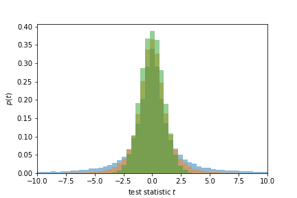
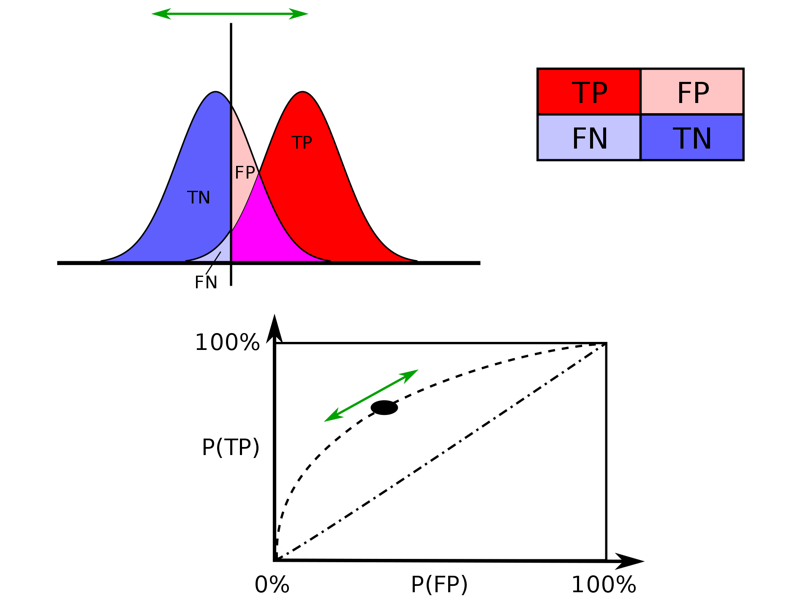

# Concepts in Statistics: A short summary

## For whom is this guide?

- you have a solid understanding of math (probability distributions, Taylor series, Fourier transforms and random numbers), but do not yet understand statistics
- you may have used hypothesis tests before, but don't know why should use one hypothesis test over a different one
- you'd like to see an overview of the important concepts in hypothesis testing in a single, relatively short document

## Usage

- This is a work in progress, but I'm nearly done.
- Feel free to make changes!
- Use, share anyway you like.

## Table of contents

[TOC]

# Jargon

| Term                                | Meaning                                               | Ref  |
| ----------------------------------- | ----------------------------------------------------- | ---- |
| statistic                           | any single numbers that's a function of the data      |      |
| test statistic                      | statistic used for hypothesis tests                   |      |
|                           | Test statistic distribution under the null hypothesis |      |
| likelihood (function)               | Probability of observing the data in a certain model  |      |
| central limit theorem               |                                                       |      |
| characteristic function             |                                                       |      |
| statistical significance            |                                                       |      |
| statistical power                   |                                                       |      |
| false positive error (type 1 error) |                                                       |      |
| false negative error (type 2 error) |                                                       |      |
| most powerful test (MP)             |                                                       |      |
| uniformly most powerful test (UMP)  |                                                       |      |
| Neyman-Pearson lemma                |                                                       |      |
|                                     |                                                       |      |
|                                     |                                                       |      |

# Statistics and test statistics: What are they and why do we need them?

**Summary: **Test statistics are single numbers that we use to test whether two processes are statistically identical. We discuss the properties that test statistics must have.

To do hypothesis tests, we use *test statistics*. For example, if we'd like to test whether the random numbers  from process A are bigger than those  of process B, a test statistic could be , which is  if the numbers from A are consistently bigger. However,  only takes into acount *one* number, making it very susceptible to noise. Thus, we'd like to sample more often to make our testing procedure more reliable. So what about  for  samples? Unfortunately, this test statistic suffers from a different problem: bigger values of  will typically make  consistently grow in the positive or negative direction. We say that this test statistic is not *standardized*: we cannot say whether a larger  is (un)expected without first specifying .

Here are some additional poor choices of test statistics:

-   -- because it is naturally biased towards )
-  -- it doesn't depend on  and isn't biased towards  or , but it doesn't take into account the natural size of randomness of  and  (the larger the random variation in  are, the larger  will be).

A proper test statistic needs to take into account both:

- The number of datapoints by dividing by .
- Take into account the natural variation in the random variables.

We'll later prove that the *central limit theorem* provides us with a possible answer to this question in some cases. There are additional desirable properties of a test statistic (but that are not strictly necessary):

- We can find a closed solution for the distribution of that test statistic. We'll see later why that's useful.
- The 'performance' of the test statistic is good. We'll see later that not every test statistic has the same performance.
- The test statistic doesn't suffer much from practical problems such as outliers.

Statisticians developed new test statistics to improve performance in these desirable properties. That's one reason why there are so many test statistics, but we'll see that there are also more fundamental reason why we can't escape having many test statistics.

Once we have a test statistics that compares A and B (let's call it ), then probably a big value  indicates that A and B are 'not the same'. How big is big enough? How probable is probably? It would be nice to have an exact criterion for this. That's what we'll do in the next two sections.

# The likelihood

**Summary: **The likelihood function of a model is the probability of observing data under that model.

The *likelihood of a parameter  is the probability of observing data, given that I know *. The likelihood function for a parameter  written as , where  is a model parameter and  is a datapoint. But that's just mathematical formalism -- what it means is  (notice the arguments were interchanged!). For a model that predicts data extremely well, the likelihood will be high. Therefore, the likelihood expresses a 'goodness of fit' of a model to the data. This does not mean that that model is 'correct', however, since we might have two models that both correctly predict a small number of data-points.

Often, a model has more than one parameter. Then we might write a 'parameter vector'  for all the different model parameters. And almost always do we have more than one datapoint . The likelihood is then just written . The more datapoints we have (so the bigger the size of the set  ), the less likely getting *one specific* set of values for those datapoints becomes.[^why-more-datapoints-decrease-likelihood] If the datapoints are *independent*, meaning that gathering the sample  did not affect what  was going to be, then the probabilities factorize , so also the likelihoods factorize:

[^why-more-datapoints-decrease-likelihood]: For example, suppose we have a fair coin. What is more probable, throwing once heads, or throwing the exact combination {heads, heads, tails, head, heads, tails, tails, tails, heads}?

If the data is distributed as a Gaussian around some average, then

so that immediately gives the likelihood of :

The likelihood of getting multiple datapoints with the same parameters (assuming the datapoints are indepdent) is then

# Distributions of test statistics

**Summary: **The values of a test statistic are described by a probability distribution. We show what that distribution is for two simple cases.

A test statistic  is a random number, because it is a function of the data, and is therefore characterized by a probability distribution . I specifically added a conditional on , because a test statistic is typically comparing some observed data to a *known model* (which has parameter(s) ). Each different test statistic will have its own distribution. This is another reason why there are so many probability distributions in classical statistics: for each different test statistic that we propose, we potentially introduce a new, yet unknown distribution! Finding  can be challenging, but for the simple case of comparing the mean of data to a known model, the *central limit theorem* can be used to compute  analytically.

# Central limit theorem

**Summary: **We show that  is a well-chosen test statistic by deriving the central limit theorem. For this, we use the Fourier transform of the probability distribution of random variables, called the characteristic function.

## Conceptual Description

Suppose we have random variables , . We'd like to know whether the *average* of ,  (I left out the  because we assume all  are identically distributed) is equal to some known model. The model both has a specified mean and variance. We now make an *Ansatz* for a test statistic, and we'll see that this form can be used to analytically compute the probability of getting a certain value of that test statistic under the model. The Ansatz is:

where  is the number of random variables,  is the model average that we're comparing the data with and  is the model standard deviation that we're comparing the data with.  This form is based on the observation that , .

Using the central limit theorem, we can show that the quantity  has a distribution that no longer depends on  or . Thus, by first rescaling the data in a clever way, we have found a single distribution that captures how different the sampled mean  is from the model (as described by )! This distribution is  (the approximation improves with larger ). If  is very small, then our data is very unlikely under the model. That might mean that our data is not described by the model. We'll discuss later how to make that more quantitative.

Derivation of Central Limit Theorem

To compute the distribution of , , we first split it up into smaller terms: , where . We do this because  has the nice properties that . We now compute the *characteristic function* of , which is just the Fourier transform of :

This might seem very ad hoc, but we'll see that this makes our derivation easier. This is not complete coincidence, since derivatives of the characteristic function can be related to averages, variances, etc. Since the exponent transforms a sum into a product (), we find that

where in the last step I used the fact that the  are all identically distributed and so have the same characteritic function. We use an additional property of the characteristic function, namely , to find

This is useful because  for increasing , which means we can now *Taylor expand* the characteristic function. This gives for the right hand side

These three terms are, using the definition of the characteristic function,:

- .
- , because it is an odd function (the integral over the positive and negative  cancel each other out)
-  (as we defined the variance of  before).

Thus, we find for the characteristic function

Now that we have the characteristic function of , we in principle can also compute its probability distribution. For the particular form we found this is very easy, because the Fourier transform of a Gaussian is a Gaussian! This means that, if  is a Gaussian, then  must be also a Gaussian. In particular,

So we computed the distribution of the test statistic , and found that it does not depend on either the number of samples  or the variance of the data  anymore!

</derivation>

## Now that we have the central limit theorem, are we done?

**Summary: **We first propose a test statistic  if the model does not have a known . We then show that the distribution of this test statistic  is the Student's distribution.

Are we done? No. The central limit theorem made several assumptions that can be broken. Most importantly:

- the datapoints are independently sampled and identically distributed
- the number of datapoints is large
- the model that we're comparing the data with has *known parameters* ( and )

Especially the last one's important. What if we'd like to compare the average of a sample with a model, but we don't know the variance of that model? Let's just try the next best thing: using the *sample* standard deviation  instead of the *model* standard deviation . We then have test statistic . This is the famous *t-statistic*, and it is not distributed according to a Gaussian.

Here's the distribution that I found numerically for different values of  (blue: , orange: , green: ):

For many samples , the distribution of  looks like a Gaussian. This makes sense, because if we sample very often then of course the sampled standard deviation should look very much like the 'real' standard deviation, , so  will be the same as  as we found using the central limit theorem. For only a few samples , then  can be very different to . Moreover, since , if  happens to be very small just by random chance, then  can become very big. This is why the distribution of  has *fat tails* for small values of . The family of functions  is called the *Student's distribution*. It is not trivial to derive the formulae for , but you can see the sketch of a derivation below.

Sketch of derivation of Student's t-distribution

The student's t-distribution is (for simplicity I first subtracted  from the datapoints)

where  is the sample variance. To get to , we need to go through the following steps:

1. ***Task:*** Compute .
   ***Method 1 (common)***: We typically *assume* that $p(x_i)$ is a normal distribution with variance $\sigma^2$, so that $p(\sum_i x_i / n) = \mathcal{N}(0, \sigma^2 / n)$.

   ***Method 2 (general):*** We can find a more general rule for the distribution of a sum by recognizing that the characteristic function satisfies
   $$
   \phi_{U+V}(k) = \langle \exp(ik(U+V)) \rangle = \langle \exp(ikU) \rangle\langle \exp(ikV) \rangle = \phi_U (k) \phi_V (k),
   $$
   and that multiplication in $k-$space corresponds to convolution in real space, so that $p(z=U+V) = (p(U)*p(V))(z)$. So if we know $p(U),p(V)$, then $p(z)$ can formally straightforwardly be found (although the convolution might be a messy integral to compute).

2. ***Task*:** Compute . ***Method:***

   1. Compute $p(y=x^2)$. This can be found using the conservation of probability, $|p(y) d y| = p(x)dx$. From this follows that $p(y=x^2) = \frac{1}{\sqrt{2\pi y}}e^{-y/2}$ .
   2. Now that we have $p(y = x^2)$, we need to find $p(\sum_i y_i)$. For this, we use the convolution theorem for summed variables that we found before.
   3. We now need to find $p(s={\sqrt z}^{-1})$ , which can again be found by using conservation of probability.

3. ***Task:*** Compute . ***Method:***

   1. $p(t) = \int ds ~ d\bar x \delta( t- \sqrt n \bar x / s) p(\bar x) p(s)$
   2. Using a variable substitution, we can express the above integral in terms of Gamma functions.

# What do we do with the distribution of a test statistic?

**Summary: **The distribution of a test statistic can be used to compare data against a null hypothesis.

Whatever the form of the test statistic, let's use  as a catch-all symbol, we have been frequently referring to this distribution  where  is some model parameter. Why is this a useful quantity? It allows for us to first propose a *null hypothesis* in the form of a model, and then to compare the data probability, under that model.

When comparing the data against a null hypothesis, the idea in the scientific method of *falsifying* a hypothesis very naturally arises: we first propose a null hypothesis model , and can then see whether the observed data is (im)probable under that model .

## Flow chart of the process of setting up a test procedure

1. Assume a null hypothesis :
   - $H_0$ refers to some kind of expectation about your data
   - $H_0$ can be fully parametrized, as was the case when we compared data against a Gaussian with known $\mu,\sigma$; or only be partially parametrized, as was the case when we estimated $\sigma$ using $s$; or even be non-parametrized.
   - $H_0$ makes a statement about the value of a statistic, e.g. that the mean is a certain value.
2. Propose a test statistic  that captures whether  is true or not.
3. Compute the distribution of  *under *, . Important: in computing , we assume that the data was generated by the process that is consistent with .
4. Give your test statistic  and its associated distribution a cool-sounding name, like *The Pirate-Z* and the *Harr-Distribution* .

## Why are there so many test statistics? Why are there so many distributions in hypothesis testing?

As we can see in the above flow-chart, testing different quantities needs different test statistics. Testing for whether the median is different in your data compared to a null model? You need a new test statistic! Testing for whether the variance in your data is different to the null model? You need a new test statistic! Comparing the mean of two samples against *each other*, both with their own sample variances? You need a new test statistic! Additionally, if your null model is not fully parametrized, then you might have to estimate that unknown parameter in your test statistic.

It's easy to see why the number of test statistics will expand to account for all these combinations. For each new test statistic that we propose, we have to compute its distribution under the null model . In some cases,  might be a known distribution from a different problem, but often it is not. This is one reason why the number of distributions is so large: we have to account for all the possible test statistics that we want to use.

# How do we 'accept' or 'reject' a hypothesis?

**Summary: **We discuss false positives, false negatives, and that there exists are trade-off between these two.

When comparing data to a null model  (which is true or false), we can reject or not reject that hypothesis. Thus, there are four combinations in total of accepting/rejecting a true/false null hypothesis. Amongst these, there are two erroneous conclusions: rejecting a true null hypothesis ('false positive' or 'type 1 error') and falsely accepting the null hypothesis ('false negative' or 'type 2 error').

Let's denote the false positive and false negative errors by respectively  and . The highest value of  that we're willing to accept is also called the *significance*, and the lower the significance the fewer false positives we make (lower is better, everything else being equal). For some reason that I do not know, statisticians more often use the number  over  directly, and they call  the *statistical size*. When comparing two hypotheses that are mutually exclusive, but when one of them is for sure true, then  is the *true positive* rate. So statistical power is another word for true positive rate in these cases. That  is the true positive rate when  is the false negative rate might not be intuitive, but this can be easily shown, as we do in the next subsection.

## How to get the true positive rate from the false negative rate

The true positive rate is , where the symbol  refers to 'rejecting the null hypothesis'; and the tilde means that the  is false. The false negative rate is . Since we either accept or reject the hypothesis, we have , so we find that the true positive rate .

## There exists a trade-off between the false negative and false positive rate

Ideally, we'd like to make both  and  as small as possible. It turns out that this is not always possible: there is a *trade-off* between false positives and false negatives. I do not know how general this statement is, or whether there are cases when there isn't a trade-off, but for any hypothesis test by thresholding the test statistic, this trade-off is inevitable. The relationship between  for a given model and its data can be visualized in the *receiver operator characteristic* (ROC), which is just a fancy term for a graph with the statistical error rates. The graph below [from Wikipedia](https://commons.wikimedia.org/wiki/File:ROC_curves.svg) illustrates this trade-off and the corresponding ROC curve.

Although there is a trade-off between  and  *for a given test*, it is perfectly possible for test procedure A to have its error rates always be smaller than of a different test procedure B (i.e. that  and ). In fact, it turns out that, for a given maximum value of , there is a test procedure that unambiguously produces the lowest value of . A test that satisfies this condition is called *most powerful*, and for a certain type of hypothesis the likelihood ratio is the test statistic that provides this most powerful test. Thus, **some test statistics are really better than others** That statement is subject of the Neyman-Pearson lemma, which we have reproduced below.

## Why some test statistics are better than others (Neyman-Pearson lemma)

**Summary: **For a given statistical significance , different test statistics provide different rates of false negatives. A test that has the lowest rate of false negatives is called *most powerful*. It turns out that for some hypotheses, we can prove that the likelihood ratio provides the most powerful test for every .

Proof of the Neyman Pearson Lemma

We will show that the test statistic

where  is data and  are two possible values of a model parameter ( is the null model value), is the most powerful test statistic for a certain type of hypothesis. The type of hypothesis is one that uses a rejection region, rejecting the hypothesis if  lies in a certain region. Concretely, the rejection region is  where  is a number chosen such that .

Our task will be to show that , i.e. that the test statistics  with associated rejection region  is always more powerful than the other test with region .

For this different test statistic with its own rejection region, we have . For this test to have significance level , we have . We will now do some manipulations of the intervals in  to make a comparison between the two.

First, we note that, in general

for any regions  and  is the complement of . We plug this into the definition of the significance level ():

We now have

where I plugged in  inside the region  so also inside the region . Thus

So , which by  implies that . We have thus found that the likelihood ratio  has, for any choice of the significance level , the lowest possible false negative rate  amongst any possible test statistic we could have chosen.

